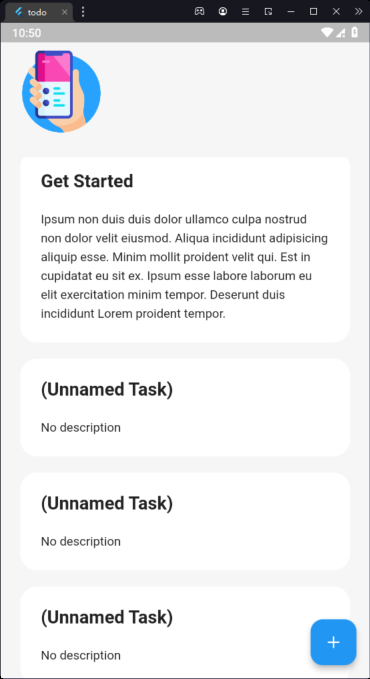

## This is a simple Todo app built using Flutter framework. The app provides basic features such as adding, editing and deleting todos, and marking them as completed.
Screenshots

## Here are some screenshots of the app in action:

Todo App Screenshot 1

Todo App Screenshot 2
## Features

    Add new todos
    Edit existing todos
    Delete todos
    Mark todos as completed
    Filter todos by status (completed, active, all)

## Installation

To install and run the app, follow these steps:

    Clone the repository: git clone https://github.com/mhmadamrii/Flutter-todo-app.git
    Open the project in your favorite code editor
    Run flutter pub get to install the dependencies
    Run flutter run to launch the app

## Contributions

Contributions are welcome! If you find any bugs or have any feature requests, please open an issue or submit a pull request.
License

This app is open source and released under the MIT License. Feel free to use and modify the code for your own projects.
